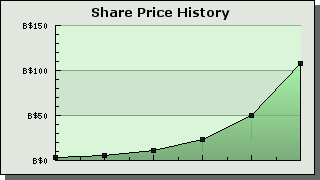

As usual, blogging will be light at best over the Christmas-New Year period.  Thanks to IE readers, tipsters and advertisers for their support throughout the year.  Hope you had as much fun reading it as I did writing it.

Having spent much the last 12 months rubbishing the notion of ‘bubbles’ in asset prices, I should draw readers’ attention to a bit of asset price inflation in which you are all implicated.  Here is the Institutional Economics stock price at [Blogshares](http://www.blogshares.com/ "Blogshares") since April this year:

It’s all due to fundamentals!  Back in January for another year defending capitalist acts between consenting adults against [fever-swamp Austrians](../2005/what_do_money_and_credit_aggregates_really_tell_us.qmd "fever-swamp Austrians"), [Roubini-Setser doomsday cultists](../2005/contrarian_optimism_versus_the_doomsday_cult_a_fund_managers_view.qmd "Roubini-Setser doomsday cultists"), the AEI’s [resident](../2005/the_aei_disgraces_itself_yet_again.qmd "resident") [evils](../2005/more_monetary_policy_central_planning_from_the_aei.qmd "evils"), and *Economist* [leader writers](../2005/the_biggest_bubble_in_history.qmd "leader writers").
