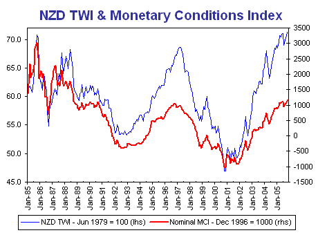

The RBNZ is widely expected to raise the official cash rate 25 bps to a record 7.25% at its December 8 Monetary Policy Statement.  With the NZD TWI at a post-float record high, this leaves nominal monetary conditions the tightest since the RBNZ was made independent in 1990.

Nominal monetary conditions are now tighter than during the mid-1990s and the MCI targeting episode from 1996-1999, prior to the introduction of the official cash rate.  Under that operating regime, short-term interest rates were market-determined, although overall monetary conditions were subject to jaw-boning by the RBNZ.  While the RBNZ was notionally agnostic on the mix of conditions, the decline in the NZD TWI during the Asian crisis caused short-term interest rates to increase, a factor in NZ’s 1998 recession.  However, as the following chart shows, the RBNZ did in fact accommodate a significant easing in overall monetary conditions during this episode:

The contrast with the current situation is that the RBNZ is raising the official cash rate at the same that the NZD TWI has risen to record highs.  While the RBNZ has sought to jaw-bone the NZD lower, such jaw-boning is pointless and self-contradictory while it keeps raising the official cash rate. 

The RBNZ is not just concerned that inflation has breached the top-side of its medium-term target range, with little prospect of returning to the target range before 2007.  RBNZ Governor Bollard is also trying to use monetary policy to contain its current account deficit and redress the underlying domestic saving-investment imbalance that is driving it.  The RBNZ is now more or less explicitly targeting house prices. 

The problem for the RBNZ is that raising the official cash rate to achieve these objectives is simply counter-productive.  A higher official cash rate encourages further capital inflow, putting further upward pressure on the exchange rate and making the current account deficit worse.  This was the lesson learned by the RBA in the late 1980s, when it sought to target the current account deficit, with disastrous consequences.  Most NZ mortgage lending is at fixed rates, so raising the official cash rate gives it little traction over household borrowing.  Indeed, the yield curve inversion being driven by the RBNZ’s tightening efforts is actually facilitating new fixed rate borrowing below variable rates.

While the RBNZ might be justified in raising the cash rate to contain medium-term inflation pressures, there is no justification for targeting domestic saving-investment imbalances and the current account deficit.  Governor Bollard has claimed that these imbalances are unsustainable, but he has not made a compelling case for a systemic failure in capital markets that would account for why these private borrowing and lending decisions are mistaken.  Nor has he made an argument for these imbalances being causal for inflation pressures, as opposed to being merely symptomatic of the underlying strength of the domestic economy.  Australia’s experience during the late 1980s-early 1990s suggests that this is a recipe for recession and the current NZ yield curve inversion certainly points to this as a likely outcome.
