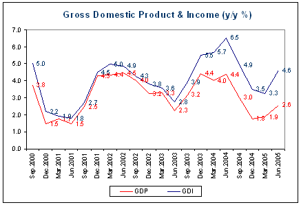

Proving once again that there is no market for good news, yesterday’s [Q2 national accounts release](http://www.abs.gov.au/ausstats/abs@.nsf/5087e58f30c6bb25ca2568b60010b303/35f488b5f9f7d242ca256df000814610!OpenDocument "Q2 national accounts release") attracted relatively little attention compared to the hysteria that accompanied the Q4 release.  The most remarkable feature of the Q2 release was the large wedge that the stunning double-digit growth in Australia’s terms of trade has driven between the gross domestic product and income accounts (shown below in y/y terms).

Gross domestic income rose 2.4% q/q compared to the 1.3% q/q rise in GDP.  GDI better captures the welfare gains arising from the increased purchasing power of domestic production that flows from an improved terms of trade.  It also puts the current account deficit in perspective, by showing the enormous welfare gains from substituting low cost imports for domestic production. 

Needless to say, the economic Armageddon that was supposed to be unleashed by falling house prices is nowhere in sight.  No doubt weakness in house prices has further to run and will have a small negative wealth effect.  But the dwelling investment cycle appears to have turned already, with both dwelling investment and ownership transfer costs making positive growth contributions in Q2. 

