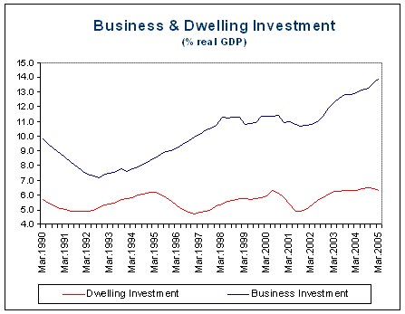

There has been scepticism in comments about my claim that Australia has experienced a non-dwelling investment boom and that this is the main driver of the deterioration in the current account balance.  The following chart shows the dwelling and private business investment share of GDP, although leaves out some investment components such as public investment.  Total investment has been at record levels as a share of GDP, yet the dwelling investment share has remained relatively stable.

\

