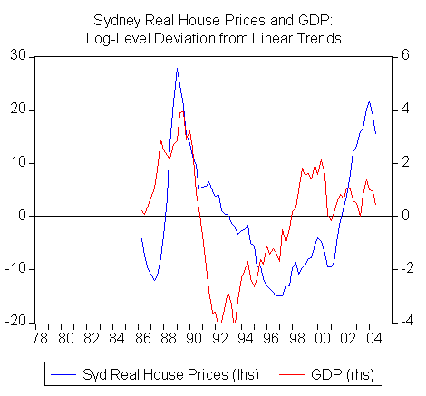

The prevailing mythology surrounding the Australian economy in recent years is that economic growth has been driven by consumption, which in turn has been driven by a house price boom.  It is true that consumption has largely accounted for headline GDP growth in recent quarters.  But as John Edwards has pointed out, consumption and national saving as a share of GDP have been remarkably steady.  What has changed is the investment share of GDP (including dwelling investment), which in real terms is currently the strongest it has been during the post-war period.  In this context, the deterioration in the current account balance is a cause for celebration, because it represents an investment boom, not a collapse in saving.

In the chart below, I have shown real Sydney house prices and GDP as percentage deviations from their linear trends.  It is remarkable the extent to which the cycle in real house prices has lagged the business cycle.  GDP has been consistently at or above trend since the end of 1997, but real house prices in Sydney only exceeded their own trend from the beginning of 2002, after a decade of below trend growth.  The chart puts the supposed ‘bubble’ in Sydney house prices in cyclical perspective.  Of course, some would argue that the secular trend in house prices is itself a bubble and one can take issue with the detrending methodology, but the notion that house prices have been leading the economy looks rather strained.

If there is anything to the stylised Australian house price cycle (turn of the decade booms, followed by middle of the decade slumps), then the cycle in house prices should bottom at the end of 2006 (as it did in 1986 and 1996), but only after the economy has already slowed for reasons that have little to do with house prices.

