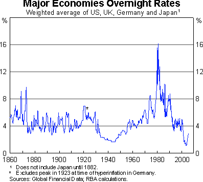

It is unfortunate that RBA Governor Macfarlane does not speak in public more often.  He has made only seven public presentations this year, including two before the House Economics Committee.  What makes Macfarlane so interesting is his deep understanding of the importance of institutions and his broad historical perspective.  Both were in evidence in his [speech](http://www.rba.gov.au/Speeches/2005/sp_gov_131205.html "speech") to the Australian Business Economists, in which he highlighted the importance of institutional change in contributing to the resilience of the Australian economy in recent years, even going so far as to suggest that Australia served as a model in this regard (for Chile anyway!)

Being something of an economic history buff, Macfarlane produced the following chart, showing the unprecedentedly low level of nominal interest rates among the world’s major economies in recent years.  He also produces a table showing that world interest rates have been very low even in real terms.

