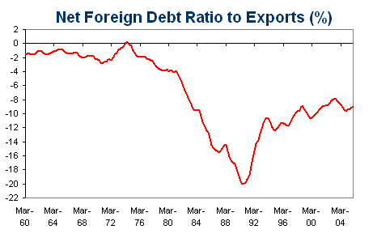

[Opposition Treasury Spokesman Wayne Swan](http://www.theaustralian.news.com.au/story/0,20867,19390241-2702,00.html "Opposition Treasury Spokesman Wayne Swan") piles on the hyperbole following the release of the Q1 current account deficit:

*“I think it is a matter of national tragedy that, given we have a global commodities boom and the best trading conditions in a generation, that we are importing into this country more then \[sic\] we are exporting,” he said.\*
\
If this is a national tragedy, it is a long running one, since Australia’s balance on goods and services has averaged -1.1% of GDP since 1960, little different from the -1.8% of GDP seen in Q1 2006.

Now that the current account deficit is actually narrowing, the sub-editors have switched their attention to record foreign debt levels for their headline grabs.  Record foreign debt levels should be no more newsworthy than the record levels of exports of goods and services that go with them: both series are subject to a secular expansion.  Press releases announcing record exports each financial year are a favourite trick of National Party trade ministers, who can practically write the press release a year in advance.  All you have to do is fill in the export numbers.

What matters is the ratio of net foreign debt to exports, which as the chart below shows has been steadily narrowing since the early 1990s.  Another reason I don’t lose any sleep worrying about current account deficits.

