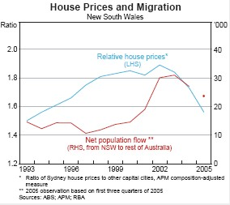

The ABS has released its [March quarter house price indices](http://www.abs.gov.au/AUSSTATS/abs@.nsf/Lookup/6416.0Main+Features1Mar%202006?OpenDocument "March quarter house price indices"), which continue to show divergence between house prices in Sydney and the other capitals.  As we have noted previously, the heterogeneity in capital city house price inflation argues strongly against attempts to explain house prices with respect to national factors, such as fiscal and monetary policy.  It also suggests that it is the economy that drives house prices, rather than the other way around.  House price inflation is strongest in those states benefiting most from the commodity price boom, a development exogenous to the Australian economy.

The RBA’s most recent [Statement on Monetary Policy](http://www.rba.gov.au/PublicationsAndResearch/StatementsOnMonetaryPolicy/Statements/statement_on_monetary_0506.pdf "Statement on Monetary Policy") noted the role of divergences in regional economic performance and inter-state internal migration as a driver of relative house price movements. 

