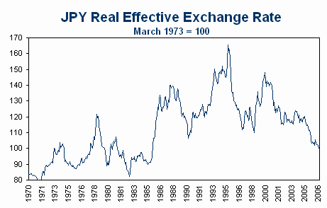

[Nouriel Roubini](http://www.rgemonitor.com/blog/roubini/167408 "Nouriel Roubini") dusts off his US dollar bear call, relying on that old faithful of structural US dollar bears, the current account deficit:

> *The large, still growing and eventually unsustainable US current account deficit is the structural gravity force that will keep on weakening the dollar over the medium term.*

These ‘structural gravity forces’ must work differently for Japan, which runs a structural current account surplus while its real effective exchange rate is making 21 year lows:

It seems that ‘gravity force’ doesn’t work at short horizons either:

> *I am not in the business of predicting high frequency movements of currency over the horizon of a week or a month. But my macro and medium-term perspective tells me that fall of the dollar – over the medium term – has still a very long way to go.*
