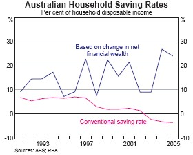

One of the more pernicious myths about the Australian and US economies is that their household sectors do not save and have lower saving rates than other industrialised countries.  This largely reflects the much higher rates of household ownership of equities in Australia and the US than other countries, an important economic strength rather than weakness, but one that is not captured by conventional measures of household saving.

The RBA’s May [Statement on Monetary Policy](http://www.rba.gov.au/PublicationsAndResearch/StatementsOnMonetaryPolicy/Statements/statement_on_monetary_0506.pdf "Statement on Monetary Policy") calculates a broader measure of household saving based on net financial wealth.  As the RBA notes, this measure ‘presents a more realistic picture of Australian household saving behaviour than conventional measures.’  It shows a steady trend in household saving.

