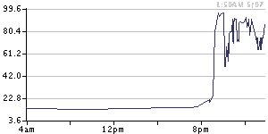
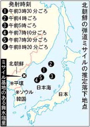

[Intrade’s](http://www.intrade.com/apply.jsp?heardFromPromotionDetail=s0545138709r "Intrade’s") North Korean missile launch contract is still trading, well after confirmation that the Norks launched at least six missiles, including a long-range Taepodong 2 that failed 40 seconds after launch.  It is not clear whether Intrade are waiting for confirmation that the missiles did leave North Korean airspace, as per the contract, or are just asleep because of the 4 July holiday in the US.  It could be that the post-launch trades will actually be unwound, back to the time of the first newswire reports of the missile launches.  Price action below:

UPDATE:  The [Mainichi](http://mdn.mainichi-msn.co.jp/national/news/20060705p2a00m0na027000c.html "Mainichi") plots where the missiles landed:

