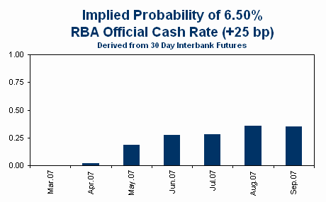

Taking a leaf from [David Altig’s](http://macroblog.typepad.com/macroblog/ "David Altig’s") regular updates of Fed funds rate probabilities, below we show the probability of a 25 bp RBA rate hike at each of the monthly post-Board meeting announcement windows. 

Probabilities are derived from 30 day interbank futures.  These are not as liquid as 90 day bank bill futures, so bid prices are sometimes substituted for last trade prices.  Only contracts for which there is currently open interest are shown.  Although it is common to estimate implied probabilities from bill futures, interbank futures have the advantage of being a monthly rather than quarterly contract and there is no need to make assumptions about the (variable) premium of 90 day bill yields over the official cash rate.

Note that the RBA has no regularly scheduled meeting in January.  The probability for January is based on an unscheduled ‘inter-meeting’ move on the first Wednesday of January.

