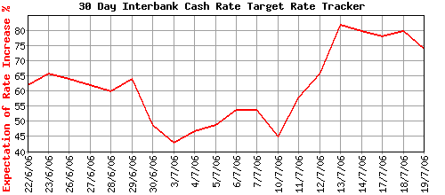

The implied probability of a 25 bp tightening in the official cash rate to 6.00% at the RBA’s August meeting has firmed in the wake of last week’s strong June employment report, peaking at just over 80%, based on the August 30-day interbank futures contract.

