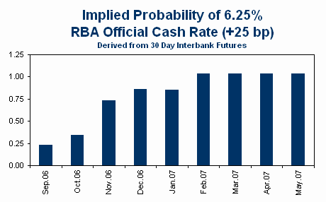

RBA rate hike probabilities implied by 30 day inter-bank futures have surged after yet another strong employment [report](http://www.abs.gov.au/AUSSTATS/abs@.nsf/ProductsbyReleaseDate/362607CA0519045ACA25712B000D0425?OpenDocument "report") that sent the unemployment rate to new multi-decade lows of 4.8% in July.  Early employment of Census workers probably contributed to the increase in employment in July, with another 10,000 addition to employment from the Census likely in August.  Of course Census workers are no more to blame for higher interest rates than [bananas](../2006/yes_we_have_no_bananas_anatomy_of_an_inflation_shock.qmd "bananas").

Every three months, the Australian and New Zealand employment reports coincide.  The two reports show the price Australia pays for a less liberal approach to labour market reform, with NZ’s [unemployment rate](http://www.stats.govt.nz/products-and-services/media-releases/household-labour-force-survey/household-labour-force-survey-jun06qtr-mr.htm "unemployment rate") re-visiting the record lows from last year at 3.6% in the June quarter.  NZ also has an official cash rate of 7.25% compared to Australia’s 6.0%.  This underscores [a point we made previously](../2006/do_you_really_want_lower_interest_rates.qmd "a point we made previously"): the sort of economic growth that drives unemployment rates to multi-decade lows is not going to give you low interest rates.  Higher interest rates reflect good economic news, not bad.

By the way, weren’t Australia and NZ supposed to be in some sort of [currency and financial crisis](../2006/a_roubini_forecast_that_is_dead_on_arrival.qmd "currency and financial crisis") by now?  Yet another failed Roubini forecast.
