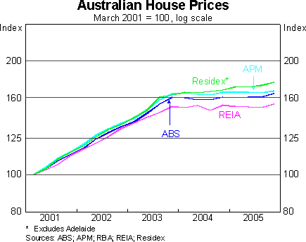

Yesterday’s [speech](http://www.rba.gov.au/Speeches/2006/sp_so_020306.html "speech") by RBA head of economic analysis Tony Richards included this chart of the various series for Australian house prices.  Looking at the level rather than the growth rate of house prices drives home the point that national house prices have been holding their own (although as previous posts have stressed, this conceals important differences between the capital cities). 

Needless to say, this is a very different outcome to the doomsday scenarios that were floated not very long ago, which promised national economic ruin on the back of a collapse in house prices (scenarios that are still getting a run in the US context).  While the Q4 national accounts were painted as soft on the back of the headline numbers, real household consumption expenditure rose nearly 3% y/y, gross national expenditure rose 4.4% y/y and real gross domestic income rose a stunning 5.2% y/y.
