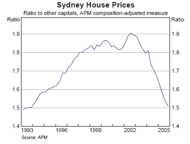

Yesterday’s RBA Statement on Monetary Policy included the following chart, showing the ratio of Sydney to other capital city house prices, using the composition-adjusted APM series:

The chart suggests the possibility of a long-run equilibrium relationship between capital city house prices.  Note that the adjustment is coming from both sides:  Sydney house prices are falling, while those in other capital cities are still rising, in some cases quite strongly.  As noted previously, those capital cities benefiting most from the commodity price boom are still experiencing strong house price growth.  Since the boom in commodity prices is exogenous to the Australian economy, this implies that it is broader economic developments that are driving house prices, not the other way around.  Internal migration is also likely to be a factor in driving convergence.

Previously, we have also noted that the global price shock to residential property as an asset class invalidated attempts to explain national house prices with reference to country-specific factors, such as changes in capital gains tax.  This chart also implies that these simplistic mono-causal explanations are also invalidated from the bottom-up.  The national story obscures what is happening on a state-by-state basis.
