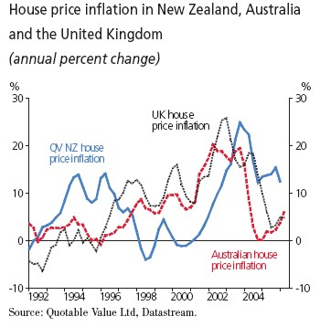

The forecasts of 20-30% declines in US house prices being offered by the [usual suspects](http://www.rgemonitor.com/blog/roubini/145489 "usual suspects") will be all too familiar to those in the rest of the Anglo-American world, which has been front-running the US housing cycle, and where such doom-mongering was also commonplace, at least until recently.  Not so long ago, an [article in the FT](https://registration.ft.com/registration/barrier?referer=&location=http%3A//news.ft.com/cms/s/c85003f2-25a9-11da-a4a7-00000e2511c8.html "article in the FT") gave a run down of the long and disreputable history of doom-mongering in relation to UK housing.  This week’s RBNZ Monetary Policy Statement produced the following chart, showing what has happened with UK, Australian and New Zealand house prices:

The experience of Australia and the UK is remarkably similar.  The resilience of house prices in New Zealand reflects the sharp inversion of its yield curve, which has facilitated fixed rate lending below floating rates, so that the effective mortgage rate has not fully reflected the significant monetary tightening put in place by the RBNZ.  Given the significant amount of NZ mortgage debt coming up for re-pricing over the next two years, the RBNZ is forecasting annual house price growth bottoming out at around -5% by the end of 2007, returning to flat growth by the end of 2008, but the RBNZ admits that housing has proven much more resilient than it expected.
