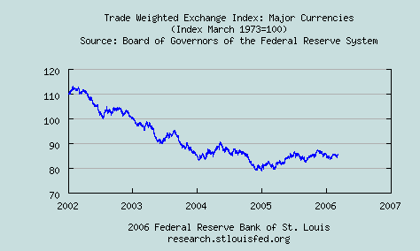

The FT [interviews](http://news.ft.com/cms/s/49b5d87e-af37-11da-b417-0000779e2340.html "interviews") the (thankfully) retiring editor of sister publication, *The Economist*:

*One of his most embarrassing covers, according to Emmott, was in March 1999, about a subject that should have been simple Economist territory: the price of oil. It had its roots in a lunch with an oil company executive, where everybody started musing that, with the oil price at \$10, what would happen if it fell to \$5? A cover saying that the world was drowning in oil, and noting the possibility of a fall in the oil price, duly appeared. But before the end of the year the price had more than doubled. “It was most embarrassing,” he says candidly.*

I could suggest a few [others](../2005/the_biggest_bubble_in_history.qmd "others").  There was also that [2 December 2004 leader](http://economist.com/opinion/displayStory.cfm?story_id=3446249 "2 December 2004 leader") on “The disappearing dollar” that said “the \[US\] dollar could tumble further and further.”  The end of 2004 proved to be a major cyclical low for the USD.  Contrarian indicators don’t come much better.

