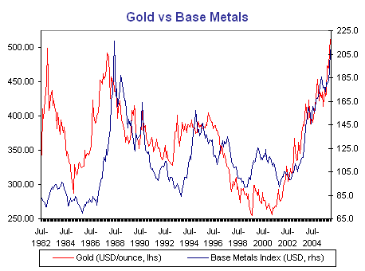
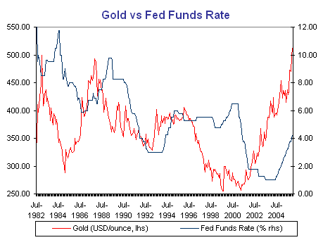

The 25 year highs in the nominal gold price have seen the gold bugs out in force.  It is often claimed that gold has special properties, either as a leading indicator of inflation or the stance of monetary policy.  Yet gold’s correlation with commodity prices in general suggests that it has no special properties in this regard.  The following chart shows the USD gold price, alongside an index of base metal prices in USD terms:

The most that could be said for gold is that there have been episodes where the gold price has led base metal prices.  As an indicator of the business cycle and inflation pressures, base metal prices would seem to be a better coincident indicator, which follows logically from their use in a much wider range of industrial applications.  Even gold’s role as a store of value is not entirely unique, since base metals are also subject to inventory cycles and inter-temporal arbitrage. 

The next chart shows gold alongside the Fed funds rate:

Again, gold would seem to lead Fed funds, although one could just as easily argue that the Fed funds rate is a lagging indicator of the business cycle!  If we are to take gold seriously as an indicator of the stance of monetary policy, then we would have to argue that policy was too tight from the mid-1990s through to the early 2000s, contrary to what is indicated by base metals prices.  This would argue against the notion that monetary policy was accommodative during the late 1990s equity market boom. 

There are of course those who argue that the gold price was being artificially suppressed by official sector gold sales during the late 1990s and early 2000s.  If one thinks that a market price is being manipulated in this way, then this is an even stronger argument for not using it as an indicator.
