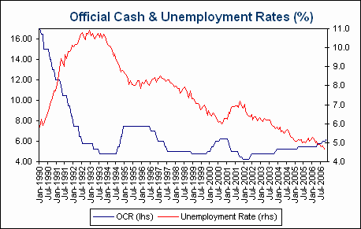

‘Who do you trust to keep the unemployment rate low?’ might have made a better campaign tag line for the Coalition at the last federal election.  In the same week that the unemployment rate fell to a new 30 year low of 4.6%, the government found itself on the defensive over the RBA’s latest official interest rate increase.  The further decline in the unemployment rate was even interpreted as ‘bad news for interest rates.’  This is the same perverse logic that argues we should forgo tax cuts for the sake of lower interest rates.

As the following chart shows, there is a close relationship between turning points in the unemployment rate and the official cash rate.  This suggests that the RBA looks for confirmation from the unemployment rate before changing the direction of official interest rates.  The sort of economic growth that drives the unemployment rate to 30 year lows is not going to give you low interest rates.  Indeed, it is remarkable that the RBA held interest rates below their previous cycle peak for as long as it did through the current tightening cycle. 

Neither the government nor the Reserve Bank has much to do with the direction of interest rates.  Australia is a price-taker in global capital markets and the direction of interest rates in Australia is largely determined offshore.  Claiming credit for low interest rates leaves the government hostage to forces beyond its control and on the defensive even when the economic news is good.
