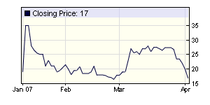

Just in time for April Fool’s Day, Time magazine profiles [The Armageddon Gang](http://www.time.com/time/magazine/article/0,9171,1604936,00.html "The Armageddon Gang").  As the article notes, their ‘stark, almost Puritan way of looking at the world… has been out of step with economic reality for the past quarter-century.’

Meanwhile, [Intrade’s](http://www.intrade.com/apply.jsp?heardFromPromotionDetail=s0545138709r "Intrade’s") US 2007 recession contract is in the grip of a bear market of its own:

