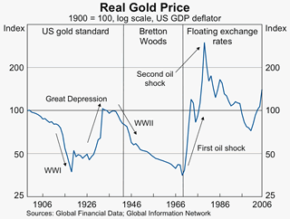

The [RBA Bulletin](http://www.rba.gov.au/PublicationsAndResearch/Bulletin/bu_apr07/rec_rise_com_prices_long_run_pers.html "RBA Bulletin") puts the recent boom in commodity prices in long-run perspective.  The article includes the following chart of the real gold price.  The chart shows that gold makes a poor long-run investment.  The best that could be said for gold is that it has held its value over the long-run, but with some very pronounced cycles along the way.  The long-run returns to gold are paltry compared to the real returns from equity indices like the S&P 500 over the last century.

