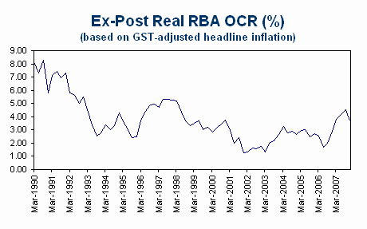

Every time RBA Governor Glenn Stevens opens the newspaper these days, he must give thanks for having such a tame press.  On his own forecasts, both headline and underlying inflation in Australia will have a three in front of it for the rest of this decade and the first half of 2010.  Yet with the honourable exceptions of Terry McCrann and Alan Wood, Australia’s economic commentators are near unanimous in arguing that it’s all the fault of fiscal policy (meaning tax cuts).

This view misunderstands Australia’s macro policy framework, which assigns the job of demand management and inflation control to the Reserve Bank.  Those who are opposed to further tax cuts are effectively arguing that the government should engineer a taxpayer-funded bail-out of monetary policy.  Needless to say, this strategy won’t work, because higher taxes would simply add to supply-side constraints in the labour market. 

It also ignores the obvious conclusion to be drawn from two very simple metrics that can be applied to assess the stance of monetary and fiscal policy.  The Commonwealth’s 2005-06 and 2006-07 underlying cash surpluses were at their highest as a share of GDP in nearly 20 years.  Fiscal policy is thus unambiguously tight, even after all the previous tax cuts that the commentariat have for the most part opposed.

The same cannot be said for the real official cash rate, the best measure of the stance of monetary policy.  With underlying inflation at 3.6% in Q4, the ex-post real cash rate was a mere 3.15% taking the year-ended official cash rate of 6.75% and 3.4% using the current official cash rate of 7.00%.  According to the RBA’s own policy simulation model, Australia’s neutral real cash rate is 3%.  So when the RBA’s Statement on Monetary Policy says that monetary policy is ‘on the restrictive side of neutral,’ it is talking about less than 50 basis points.  With the RBA’s own inflation forecasts having a three in front for as far as the eye can see, the ex-ante real interest rate is at best 4% (assuming steady policy). 

As the following chart shows, the ex-post real cash rate only moved to the restrictive side of neutral at the beginning of last year.  Monetary policy has been too easy for too long.  Hence the inflation problem.

