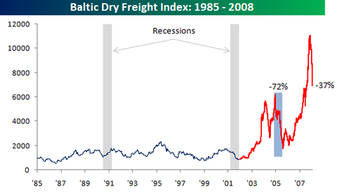

The [Baltic Dry Index](http://en.wikipedia.org/wiki/Baltic_Dry_Index "Baltic Dry Index") gets a lot of attention as a leading indicator and the signal it’s sending at the moment is certainly bearish.  The index is 37% off its peak, having recorded some of its biggest one-day declines in the history of the series dating back to 1985.  But a number of caveats are in order. 

First, the index is US dollar denominated, and the November peak coincided with the lows in the US dollar index.  Since then, the [Curse of the Economist Magazine Cover](http://www.institutional-economics.com/index.php/section/comments/the_us_dollar_and_the_curse_economist_magazine_cover/ "Curse of the Economist Magazine Cover") has worked its magic and the US dollar index is off its lows.  So at least some of the decline can be attributed to straightforward valuation effects.

Second, the massive run-up in the index probably tells us as much about supply constraints in the international shipping industry as it does the demand for commodities.  Like most people, the shipping industry was caught short by the global commodities boom and building extra capacity will take time. 

Third, as the following chart from [Bespoke Investment Group](http://www.bespokepremium.com/ "Bespoke Investment Group") shows, while previous recessions have been preceded by a downturn in the index, there are many more downturns in the index than there are recessions, including a much more dramatic downturn in 2004-05.

