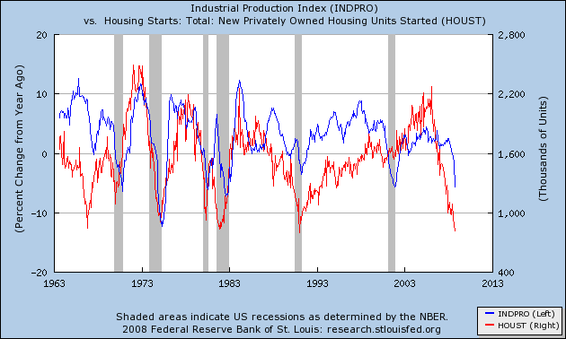

Larry White has a new Cato Briefing Paper [How Did We Get into This Financial Mess?](http://www.cato.org/pubs/bp/bp110.pdf "How Did We Get into This Financial Mess?")  White echoes a now widespread criticism of US monetary policy, that is was too easy in the first half of this decade:

> *The federal funds rate began 2001 at 6.25 percent and ended the year at 1.75 percent.  It was reduced further in 2002 and 2003, inmid-2003 reaching a record low of 1 percent, where it stayed for a year. The real Fed funds rate was negative - meaning that nominal rates were lower than the contemporary rate of inflation - for two and a half years.*

White also notes that the Fed funds rate was below that implied by the Taylor rule, a point that Taylor himself has also made.

That US monetary policy was easy at this time was no accident.  It was a very deliberate policy choice on the part of the FOMC.  Why was policy kept so easy for so long?  One reason was the perceived threat of deflation, as [Vince Reinhart](http://blogs.wsj.com/economics/2008/11/20/deflation-disaster-or-just-a-nice-discount/ "Vince Reinhart") recalls:

> According to FOMC meeting transcripts from that year, then Chairman Alan Greenspan in November \[2002\] called deflation “a pretty scary prospect, and one that we certainly want to avoid.”
>
> Then Gov. Ben Bernanke, now Fed chairman, said in September 2002, “the strategy of preemptive strikes should apply with at least as great a force to incipient deflation as it does to incipient inflation.”
>
> In hindsight while there was clearly a strong disinflation trend back then, outright deflation didn’t appear to be as big a risk as the Fed thought. Annual growth in consumer prices never fell below 1% and was rarely below 2% after 2002.
>
> The problem back then, Reinhart said, was “we didn’t know why inflation was going down as much as it was.”
>
> That year, 2002, “was very much a story of uncertainty about the inflation process with some modest identifiable forces putting downward pressure” on prices, he said.

This puts the failure of US monetary policy to respond to the emerging US housing boom in its proper context.  The following chart shows annual growth in US industrial production as a proxy for the broader economy, along with new privately-owned dwelling starts as a proxy for housing activity.  Shaded bars are NBER-defined recessions.

The 2001 recession was exceptional compared to previous business cycles, in that housing activity did not see a significant downturn along the rest of the US economy.  Industrial production was subdued coming out of the 2001 recession (note the double dip into negative growth), while housing continued to enjoy a strong expansion.  If the 2001 recession could not tame the US housing boom, then it is hard to see how tighter US monetary policy could have done so without inflicting significant, and potentially deflationary, collateral damage on the rest of the economy.

One could argue that Fed policy was a success on its own terms, because it achieved exactly what it set out to do: pre-empt the threat of deflation.
