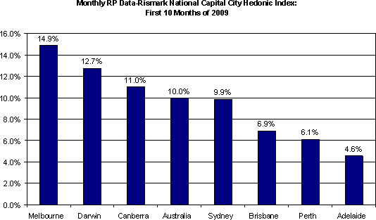
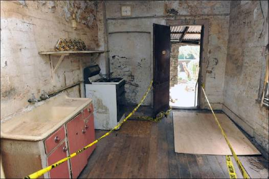

[RP Data-Rismark](http://www.rpdata.com/ "RP Data-Rismark") have released the capital city hedonic house price index for October, showing house prices up 10% YTD.

\

\
Here’s what \$1.85 million [buys you](http://wentworth-courier.whereilive.com.au/photos/gallery/amazing-auction-result-for-derelict-paddington-terrace/ "buys you") in the Sydney suburb of Paddington:

\

