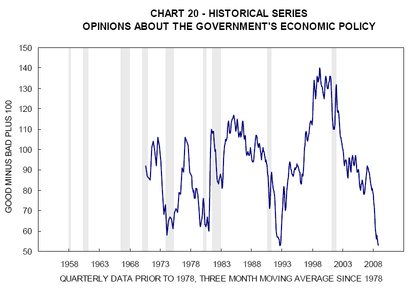

Claims about the effectiveness of fiscal stimulus in the US do not quite square with evidence from surveys of consumer confidence.  The [University of Michigan survey](http://www.sca.isr.umich.edu/main.php "University of Michigan survey") asks respondents “As to the economic policy of the government—I mean steps taken to fight inflation or unemployment—would you say the government is doing a good job, only fair, or a poor job?”  According to secondary sources, this measure posted its equal sharpest decline on record in June to 93 from 108 in May.  The chart below the fold shows the history of this series until November 2008, after which the data disappeared behind a Thomson-Reuters paywall (if anyone has the intervening data, feel free to flick it my way).  Clearly, consumers did not think much of the Bush Administration’s fiscal stimulus measures (although there is a rally around the flag effect in relation to policies pursued after September 11 2001).  The change in Administration since November last year benefited this series, but the political honeymoon now seems to be wearing off. 

This series is clearly cyclical, suggesting consumers blame economic conditions on government policy.  While consumers might be overrating the importance of government policy to economic outcomes, they are also effectively calling into question the effectiveness of the usual counter-cyclical policy responses, including fiscal stimulus. 

