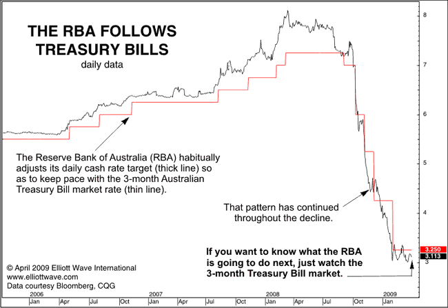

Robert Prechter’s latest [Global Market Perspective](http://www.elliottwave.com/a.asp?url=/club/gmp/default.aspx?code=30439&cn=4ie "Global Market Perspective") argues that:

> movements in the cash target rate set by Australia’s central bank, the Reserve Bank of Australia (RBA), appear to follow those in 3-month Australian Treasury Bills. After decisive moves up in T-bills from 2006 to early 2008, for example, the RBA faithfully raised its target. T-bills have since led the RBA during the financial crisis of the past year. In fact, the record indicates that the RBA almost always follows T-bills over time.
>
> 
>
> The proper conclusion to draw… is that their interest-rate decisions are not proactive, but reactive, and that they continually follow in the footsteps of the market for lack of any other useful guide…. The myth of central bank potency is so pervasive that conventional analysts can’t even imagine a better explanation for price trends: that the market is the dog wagging its central bank tail, not the other way around.

The fact that market-determined interest rates lead official interest rates does indeed have a better explanation: the market successfully anticipates central bank policy actions.  This does not render central bank policy actions ineffective, as Prechter would have us believe.  Indeed, it makes monetary policy more potent, because central banks can influence monetary conditions through open mouth rather than open market operations.  But it does point to the fact that both market and official interest rates are largely endogenous to economic activity.  Both the market and central bank look at the same data in much the same way, drawing similar conclusions.  The main difference is that the markets make these judgments every day, while the central bank acts on them more slowly.
