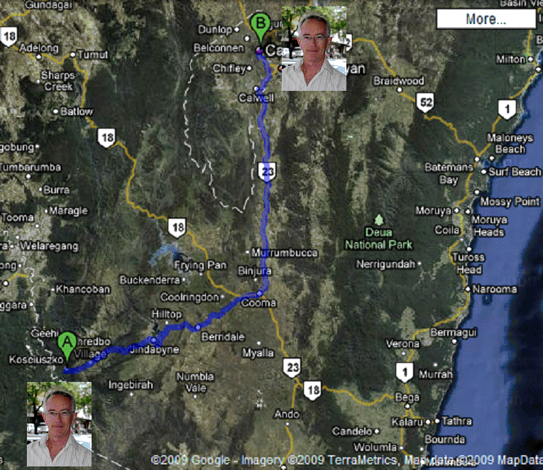

Juedische Allgemeine, Germany’s leading Jewish newspaper, recently asked Oliver Hartwich and I to write a profile of Nouriel Roubini as a counter to the numerous puff pieces in the Anglo-American press.  The German language version has yet to appear online, but there is an English language version in today’s [Age](http://business.theage.com.au/business/economist-with-a-nose-for-trouble-20090909-fho8.html "Age"):

> For years, he argued that the US current account deficit would lead to a US dollar crisis and higher interest rates, pushing the US economy into recession. But that was not how the financial crisis unfolded.
>
> One of Professor Roubini’s few specific predictions was that the US would experience zero GDP growth in the fourth quarter of 2006. This was far off the mark: the actual result was 3 per cent. After this embarrassment, he backed away from his recession prediction, writing in January 2007 that ‘it is not clear whether the bust of the housing bubble in the US will lead to a soft landing as the consensus view goes or a hard landing that could take the form of a growth recession or, less likely now, an outright recession’. The professor was hedging his bets in early 2007, clearly uncertain about the direction for the US economy.

The Age also runs a self-refuting [profile of Steve Keen](http://business.theage.com.au/business/this-keen-professor-overlooked-by-msm-20090909-fhoa.html "profile of Steve Keen") headed ‘This Keen professor overlooked by MSM \[mainstream media\].’  If only!

While on the subject of Keen, Christopher Joye has prepared a [handy route map](http://www.businessspectator.com.au/bs.nsf/Article/Rory-Robertson-Hawkish-pd20090901-VFV9Q?OpenDocument&src=is&is=Property&blog=Concrete%20Detail "handy route map") for Keen’s house price forecast death march from Canberra to Mt. Kosciusko.

