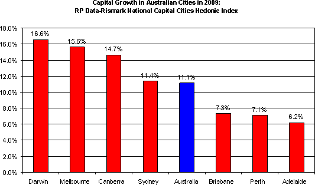

The RP Data-Rismark national capital city hedonic home price index for December shows a modest fall of 0.3% for the month, but up 2.1% for the quarter and 11.1% for the calendar year.  This follows modest declines of 2-3% in 2008, which was the worst performance in history on this measure.

