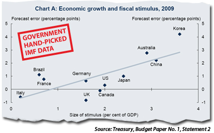
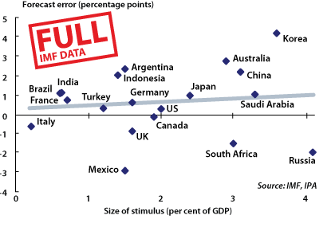

According to Treasurer Wayne Swan, the government is set to preside over the ‘most substantial fiscal consolidation in Australia’s modern history’, leading the federal budget back into surplus by 2012-13.  The OECD’s glossary of statistical terms defines fiscal consolidation as ‘a policy aimed at reducing government deficits and debt’.  But the policy measures in the government’s 2010-11 Budget make the budget balance worse, not better.  The projected improvement in the budget bottom line is more than fully accounted for by changes in forecasting assumptions. The government wants to claim credit for an improvement in the budget outlook that is entirely a product of its earlier forecasting errors.

The government’s forecast of a faster return to surplus is not evidence of fiscal discipline, but of the sensitivity of the fiscal outlook to underlying assumptions.  Similarly, the claim that the Australian economy performed better than expected through the global financial crisis is evidence, not of the success of activist fiscal policy, but the fact that the forecasts on which that policy was based were too pessimistic. 

The budget papers include a chart showing that the size of fiscal stimulus was positively correlated with the size of the forecast error for economic growth across 11 countries.  The government wants us to conclude that its fiscal stimulus is to be credited with better than expected economic performance.  But causality could just as easily run the other way: the large forecasting error led to excessive stimulus.  Since the government’s earlier budget forecasts already had the expected impact of the stimulus measures built into them, its assumptions about the effectiveness of stimulus must have been incorrect as well.  Indeed, the government now claims that the multipliers it used to estimate the impact of the stimulus were too small. But this just concedes the point that the government has no idea how effective its fiscal policy measures really were in stimulating economic activity.

What matters is the not the budget forecasts, but the policy outcomes. The Rudd government has presided over the biggest growth in federal spending since Gough Whitlam.  It is now committed to keeping real growth in federal spending below 2%. But that’s just a forecast. As the old disclaimer says, outcomes may vary.

**UPDATE:** [Sinclair Davidson](http://catallaxyfiles.com/2010/05/13/did-the-stimulus-work/ "Sinclair Davidson") includes the data Treasury could have used, but didn’t:

