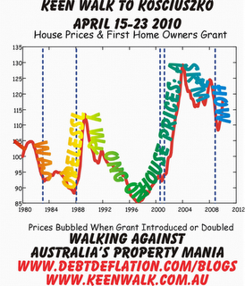

Steve Keen’s design for a t-shirt to wear on the march of his housing doomsday cult to the top of Mount Kosciuszko looks like a CAPTCHA challenge-response test:

As [Chris Joye](http://christopherjoye.blogspot.com/2010/03/steve-keens-t-shirt.html "Chris Joye") notes, the proposed design ‘directly dishonours the agreement he struck with Macquarie Bank’s Rory Robertson’ to wear a t-shirt that read ‘I was hopelessly wrong on house prices.  Ask me how’.
