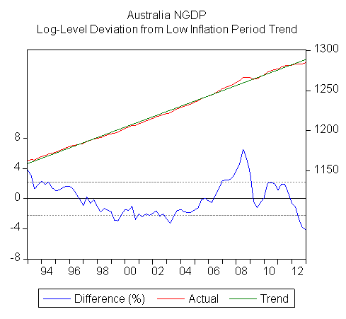

The national accounts were out yesterday, so time to update our graph of the (log) level of nominal GDP relative to its low inflation period trend. The Australian economy still sits 4% below the NGDP level stabilisation benchmark suggested by the new market monetarists, implying that monetary policy has been too tight:

The new market monetarists argue Australia was a poster child for NGDP stabilisation during the financial crisis, but I interpret things differently. Prior to the onset of the financial crisis, inflation was out of control (CPI inflation running at 5%) and nominal GDP growth was running in the double-digits. The financial crisis saved the RBA from having to induce a domestic recession to bring inflation under control. The RBA was most successful when international conditions were doing the work for them.

Lest this look like the luxury of hindsight, I was arguing much the same thing in [August 2008](http://www.theage.com.au/business/dont-count-ratecut-chickens-before-they-hatch--inflation-is-still-simmering-20080811-3to5.html?page=1#).
