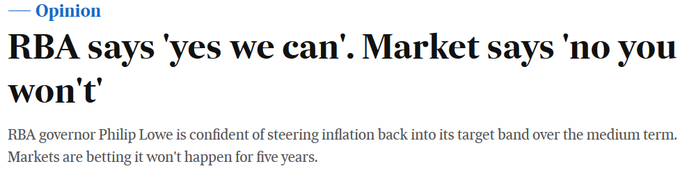

I have an op-ed in the [AFR](https://www.afr.com/policy/economy/the-treasurer-should-not-let-the-rba-off-the-hook-so-easily-20191105-p537j6) arguing that the Treasurer’s decision to leave its agreement with the RBA unchanged is a missed opportunity to hold the RBA accountable for its recent underperformance against mandate.

\
[Robert Guy](https://www.afr.com/markets/equity-markets/rba-says-yes-we-can-market-says-no-you-won-t-20191105-p537g5) has a related piece in the same edition. The headline says it all.\

\
The Treasurer just backed the RBA over what the market is telling us. We will see how that turns out.

Treasurer Josh Frydenberg has declared that “after careful consideration” and consultation with the Reserve Bank and Treasury, the government will not change its agreement on monetary policy with the Reserve Bank.

This is unfortunate, because it continues a pattern of inadequate public deliberation on the framework for monetary policy in Australia at a time when the Reserve Bank is underperforming its inflation, employment and welfare mandates.

In the United States, the Federal Reserve is currently conducting a major public review of its monetary policy strategy, albeit one that takes the existing statutory framework as given.

The Bank of Canada conducts a comprehensive review of its monetary policy framework every five years.

The Reserve Bank of New Zealand’s framework has previously been the subject of an independent review by noted monetary policy expert Lars Svensson.

By contrast, Australia has given its framework little independent scrutiny. For example, monetary policy was explicitly excluded from the terms of reference of the 2014 Financial System Inquiry.

Up until recently, there was little reason to review a framework that was working well. Under the leadership of Ian Macfarlane and Glenn Stevens, the RBA delivered on its medium-term inflation mandate. Inflation under both governors averaged in the middle of the target range. Despite significant downturns abroad, the Australian economy avoided recession, remaining close to full employment, with the unemployment rate trending lower.

When Phil Lowe became Governor in 2016, then Treasurer Scott Morrison agreed to a significant change in the relationship between the RBA’s price and financial stability mandates.

The previous Labor government’s 2010 agreement made financial stability explicitly subordinate to the price stability objective. By contrast, the 2016 agreement turned this relationship on its head, specifically allowing for “flexibility” in meeting the inflation target to pursue other objectives, including financial stability.

It is questionable whether the government understood the significance of what it agreed to 2016. Newspaper reports at the time referred to “minor tweaks” and then Treasurer Morrison said “it is similar to previous statements.”

Yet Deputy Governor Guy Debelle has said that “the articulation of the financial stability objective” is “the most substantive change” since the first statement in 1996. Financial stability didn’t even rate a mention in the agreements prior to 2010.

The new agreement has seen financial stability concerns loom much larger in the RBA’s explanations of its monetary policy actions. The RBA has explicitly traded-off its inflation target against apprehended financial stability risks, contributing to an extended period of undershooting on the inflation target.\
The 2010 agreement would have made such a trade-off difficult for the RBA to defend.

There has been little scrutiny of whether this trade-off has delivered net benefits in terms of increased financial stability that offset the costs in forgone output and employment.

The RBA’s own published research suggests these costs are much larger than the benefits. Overseas experts such as Lars Svensson have drawn similar conclusions based on Sweden’s experience and formal models of the trade-off.

In a speech in 2009, then Assistant Governor Guy Debelle argued against the idea of monetary policy “leaning against the wind” on credit growth and asset prices. He posed the question, “what would be the point of undershooting the CPI inflation target and enduring a higher than desirable level of unemployment with little to be gained. How would such actions be explained to the public?”

Josh Frydenberg could legitimately pose the same question to Governor Lowe.

Governor Lowe has made much of the third objective in the RBA’s statutory mandate requiring it to promote the “economic prosperity and welfare of the people of Australia,” as well as price stability and full employment.

But as former RBA Governor Nugget Coombs related in his autobiography, the third objective was no more than a fudge, “adopted with varying degrees and styles of reluctance,” to reconcile the first two. According to Coombs, “there was no profit to be gained from exploring legislatively the compatibility of these objectives or the nature of the trade-offs between them.”

Yet understanding the nature of these trade-offs is essential. The 2016 agreement effectively re-defined one of these trade-offs, with little scrutiny from within or outside government.

By underperforming its mandate in recent years, the RBA has not only damaged the credibility of monetary policy, it has inadvertently promoted demands for more activist fiscal and wages policy, undermining hard-won improvements in other areas of public policy.

Josh Frydenberg would have been on strong ground in ordering an independent review of monetary policy and the RBA’s recent underperformance, while reverting to the Labor Party’s 2010 agreement as interim measure to re-prioritise the inflation target pending the outcome of the review.

Dr Stephen Kirchner is Program Director, Trade and Investment, United States Studies Centre at the University of Sydney.
